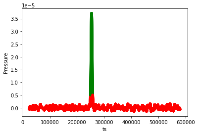

# Solution

## Phase 1
We began by visualising our data and found it very clean and regular.

We decided to use a simplistic approach in order to achieve a solution as computationally inexpensive as possible.

Visualizing water pressure over time seemed sufficient to find anomalies. We applied a rolling average function to the chaotic pressure function with a window of 100 data points. The end result was a smooth line (orange).

Next, we took a derivative of the orange line and produced a set of points with a small absolute value with occasional positive or negative peaks, which told us if spikes in the data went up or down.

A simple interval threshold `(-1e-05, 1e-05)` was sufficient to detect these spikes.

We used this data to segment our timeline into intervals and assumed the highest reached pressure level as the baseline, while any pressure drops signified probable leaks.

## Phase 2
You should describe your solution for Phase 2 here.

Example how to add images:

